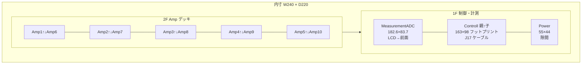

# バリアント A: Compact Stacked（フットプリント最小化）

最終更新: **2026-08-22**  
制約準拠: [`../../CASE_LAYOUT_CONSTRAINTS.md`](../../CASE_LAYOUT_CONSTRAINTS.md)

## 要約

| 項目 | 内容 |
| --- | --- |
| 目標 | 平面フットプリント最小化 |
| 1F | Controll 親・子（**縦スタック＋J17 ケーブル**）＋ MeasurementADC。Power は隙間 |
| 2F | Amp×10 = **2 段 × 5 列**（樹脂スペーサ） |
| 対象外 | PD 精密配置、EQ、RV panel / RV convert（本案に**含めない**） |
| 推奨内寸 | **W 240 × D 220 × H 120 mm**（実装余裕込み） |

---

## 1. フロア図

前面（パネル）を下図の **−Y 側**、奥を **+Y** とする。単位 mm。



### ASCII（上面・概略）

```text
        ← W 240（内寸）→
Y=220 ┌──────────────────────────────────────────┐ 奥
      │  2F: Amp×10（2段×5列）                     │
      │  [A1][A2][A3][A4][A5]  ← 各列は上下2枚     │
      │   41.5ピッチ×5 ≈ 219.5（隙間3mm込み）       │
      │──────────────────────────────────────────│
      │  1F 奥側: Controll スタック 163×98         │
      │           ┌─ Power 55×44（右隙間）         │
      │──────────────────────────────────────────│
      │  1F 前側: MeasurementADC 182.6×83.7        │
      │           LCD / Pico2 を前面・フタ寄り     │
Y=0   └──────────────────────────────────────────┘ 前面パネル
        パネル: LCD / 入出力 / VOL×2 / ロータリ / SW / LED
```

詳細寸法図: [`floorplan_1f_2f.svg`](floorplan_1f_2f.svg) / [`floorplan.txt`](floorplan.txt)

### スタッキング方針

| 層 | 内容 | スペーサ |
| --- | --- | --- |
| 底板〜1F | Controll **子**・MeasurementADC・Power を底板スタッドへ | M3×8〜10 mm ボス |
| Controll 縦 | **親**を子の上に樹脂スペーサで固定。ピン直結禁止 → **J17 4 線ケーブル** | M3 樹脂 **18〜22 mm**（部品クリア） |
| 1F〜2F | Amp デッキ（アクリル／アルミ中間板） | 支柱 **〜55 mm**（Controll スタック頭上＋配線空間） |
| Amp 縦 | 各列 下段 Amp + 上段 Amp | M3 樹脂 **18〜22 mm**（STATUS の「2 段×5・樹脂スペーサ」想定） |
| 2F〜フタ | ヒンジ蓋。Pico2 / 計測配線メンテ用空間 | 頭上 **≥15 mm** |

STATUS メモの「約 5 cm 樹脂スペーサ」は、**1F〜2F 間の柱長**のオーダーと解釈（Controll 頭上＋Amp デッキ高さの一体感）。Amp 同士の段間は部品高さに合わせ 18〜22 mm を別途。

---

## 2. 概算内寸と根拠

### 基板拘束（制約 §5）

| 基板 | 外形 mm | 枚数 |
| --- | --- | --- |
| Controll `01_main` | 162.95 × 98.20 | 2（親＋子、スタックで平面は 1 枚分） |
| MeasurementADC `06` | 182.60 × 83.70 | 1 |
| Power `03` | 55.27 × 44.01 | 1 |
| Amp `04` | 58.18 × 41.50 | 10（2×5） |

### 幅 W

- Amp を **短辺 41.50 を幅方向**に置き 5 列＋列間 3 mm:  
  \(5×41.50 + 4×3.0 = 219.5\) mm → **2F が幅の支配項**
- 1F は ADC 幅 182.6 ＋側面配線 余裕。Controll は ADC 背後に収まる
- Power は Controll 右の余り幅（240−163≈77）に **55×44 で収まる**
- 壁・スタッド逃げ片側 ~10 mm → **内寸 W = 240 mm**（タイト案 230 は配線ダクト不足）

### 奥行 D

- 前面側 ADC 83.7 ＋ 板間 8 ＋ Controll 98.2 ≈ **190 mm**
- 後面に Amp 信号／±15 束の逃げ **〜20 mm**、前面パネル部材厚の内側逃げ **〜10 mm**
- **内寸 D = 220 mm**

### 高さ H

| 区間 | mm |
| --- | --- |
| 底板ボス〜1F 基板下面 | 8 |
| Controll 子＋部品 | ~12 |
| Controll 段間スペーサ | 20 |
| Controll 親＋OLED 等 | ~15 |
| Controll 天〜2F デッキ（配線） | ~10 |
| Amp 下段＋段間＋上段＋部品 | ~40 |
| フタ内クリア（Pico USB） | ~15 |
| **合計概算** | **≈120** |

**推奨内寸: W 240 × D 220 × H 120 mm**  
（外寸は板厚＋パネル次第。市販ケースは本内寸以上を選ぶ。）

タイト下限（実装厳しい）: W 230 × D 210 × H 110 — 非推奨（Amp 列と側面逃げが干渉しやすい）。

---

## 3. 既存 M3 穴 → スタッド／シャーシ

基板に **新規ドリルを増やさない**。すべて既存 MountingHole（drill 3.2 / M3）を使用。

### 1F 底板（シャーシ or 内側ベースプレート）

| 基板 | 穴（ローカル mm） | 落とし方 |
| --- | --- | --- |
| MeasurementADC | (3.50,3.50)(77.64,3.51)(179.08,3.51)(3.47,80.20)(89.39,80.22)(179.09,80.18) | 底板に **M3 PEM スタッド or タップ柱** 6 本。前縁をパネル内側 ~12 mm に合わせる |
| Controll 子 | (3.50,3.50)(159.50,3.50)(3.50,94.70)(159.50,94.70) | 同上 4 本。ADC 後縁から 8 mm 空けて配置 |
| Controll 親 | 子と **同一 XY** | 子のスタッドに **通しボルト＋樹脂スペーサ**で親を載せる（親用の追加シャーシ穴不要） |
| Power | (3.52,3.51)(51.77,3.51)(3.52,40.51)(51.77,40.51) | Controll 右隙間に 4 スタッド。底板座標は Controll 原点からのオフセットで固定 |

### 2F Amp デッキ

| 項目 | 内容 |
| --- | --- |
| 下段 Amp×5 | 各板 4 穴をデッキ板の M3 スタッドへ。列ピッチ **44.5 mm**（41.5＋3） |
| 上段 Amp×5 | 下段と同一穴 XY。樹脂スペーサ経由の **通し M3**（デッキ穴は下段用のみで足りる） |
| デッキ支持 | 四隅＋中間を底板から M3 支柱（または側壁ブラケット）。基板穴は使わない |

Amp 穴ローカル: (3.48,3.47)(54.73,3.42)(3.48,38.02)(54.63,37.97)  
※ 本案では基板を 90° 回転し、**41.50 辺を幅方向**にするため、デッキ上の穴パターンも回転後座標で転写する。

---

## 4. パネル穴リスト

前面を主操作面。座標は **パネル内面・左下原点**、仮置き（未確定は TBD）。

| # | 開口 | 穴径 / 形状 | 仮位置 (X,Y) mm | 備考 |
| --- | --- | --- | --- | --- |
| 1 | LCD（WAVESHARE-29318） | 表示有効エリア＋ベゼル逃げ（外形に合わせた矩形） | 中央やや左 (40, 35) 付近 | **必須**。ADC を前面直近に置く |
| 2 | 入力ジャック L/R | 型番 TBD（例: φ6 系） | (20, 15) / (35, 15) | ボリューム手前 |
| 3 | 出力ジャック L/R | 同上 ×2 | (200, 15) / (215, 15) | |
| 4 | ボリューム ×2 | 軸穴 型番 TBD | (55, 15) / (75, 15) | スイッチではない |
| 5 | ロータリ（Controll J13） | エンコーダ軸＋ねじ穴 TBD | (100, 15) | 親ボード側。延長軸 or 基板寄せ |
| 6 | 全体 ON/OFF | トグル/ロッカ TBD | (130, 15) | |
| 7 | 電源 LED ＋メタルカバー | **≈6.5 mm** | (150, 15) | φ5 LED・12V |
| 8 | USB（計測 Pico2） | フタ側 or 後面寄り | フタ内 | ヒンジ蓋メンテ前提。前面必須ではない |

ジャック・ポットの正確な中心は部品確定後に更新（現状 TBD）。

---

## 5. ケーブル表

線径方針: 信号 30AWG 可、±15 / PD / 電源系は **26AWG 寄り**。A_GND は分配器でスター／バス（ループ禁止）。

| # | From → To | 用途 | AWG | 概算長 mm |
| --- | ---: | --- | --- | ---: |
| 1 | Controll 親 J17 → 子 J17 | I2C カスケード `GND/3V3/SCL/SDA`（**ピン直結禁止**） | 30 | 80〜100（寄り添わせ短く。400 kHz） |
| 2 | 入力ジャック → ボリューム手前端子 | 入力 L/R | 30 | 120 |
| 3 | ボリューム → Controll 入力 | レベル調整後信号 | 30 | 150 |
| 4 | 入力分岐 → MeasurementADC | スペアナ ハイZ タップ | 30 | 100 |
| 5 | Controll → 2×6 分配（信号） | Amp 選択前の分配 | 30 | 180 |
| 6 | Controll リレー出 → 各 Amp 電源入 | 選択中 Amp のみ ±15 | 26 | 200〜280（列位置で差） |
| 7 | Power MCW03 二次 → 2×6 分配 | ±15 / A_GND 供給 | 26 | 120 |
| 8 | 分配器 → Controll AMP_PWR_IN | Controll 側アナログ電源 | 26 | 100 |
| 9 | 分配器 → MeasurementADC ±15V_A / A_GND | 計測アナログ | 26 | 150 |
| 10 | 分配器 A_GND → Amp×10 / 端子 0V | アナログ GND | 26 | 200〜300 |
| 11 | Controll → 出力ジャック ×2 | Amp 経由後の出力（実配線は Amp 出→ジャック） | 30 | 220 |
| 12 | Amp 出 → 出力ジャック | 最終出力 L/R 集約 | 30 | 180〜250 |
| 13 | PD（外部）→ Power / Controll / 計測デジ | +15/PD_GND 直結系 | 26 | TBD（配置対象外） |
| 14 | 前面 SW → 電源経路 | 全体 ON/OFF | 26 | 150 |
| 15 | 前面 LED → 12V 表示回路 | 電源表示 | 30 | 120 |
| 16 | Controll 親 → 前面ロータリ | J13 延長（必要時） | 30 | 100 |

将来: 入力分岐 → HP ゲイン1倍バッファ（未製）は同タップ点から追加可能。

---

## 6. リスクとトレードオフ

| # | リスク | 影響 | 緩和 |
| --- | --- | --- | --- |
| 1 | **Amp 2 段の放熱・メンテ** | 上段交換・温度上昇 | デッキに通気、フタヒンジ、列間 3 mm 以上、必要なら金属デッキで熱拡散 |
| 2 | **高さ方向の干渉** | Controll スタック頭と 2F Amp／配線が当たる | 1F–2F 支柱を実測後に確定（目安 55 mm）。OLED・リレー高さ要実測 |
| 3 | **線長と 400 kHz I2C / アナログ** | Controll 親↔子・Amp 電源ハーネスがノイズ源 | J17 は最短寄り添い。電源 26AWG・A_GND スター。フロア間は束ねて側壁沿い |
| 4 | 幅が Amp 5 列に支配される | 「全面一面」より小さいが W≈240 は必要 | これ以上の平面縮小は Amp 3 列化等が必要で本バリアント外 |
| 5 | ロータリが Controll 親上段 | パネル軸合わせが難しい | 延長シャフト or 親を前面寄りにオフセット（穴は既存のまま基板位置で調整） |

### トレードオフ（他方針との比較）

- **得るもの**: 平面最小級。Controll 2 枚分の床面積を 1 枚分に圧縮。STATUS の 2 段×5 想定と一致。
- **失うもの**: 高さ増、Amp 上段のサービス性、配線密度。平面ワイド案（Amp 平面 10 枚）より組み立て難度は高い。
- **含めないもの**: RV panel / convert、PD 最適化、EQ。

---

## 7. ファイル

| ファイル | 内容 |
| --- | --- |
| [README.md](README.md) | 本設計書 |
| [floorplan_1f_2f.svg](floorplan_1f_2f.svg) | 1F/2F 上面の簡易寸法図 |
| [floorplan.txt](floorplan.txt) | テキスト寸法図 |

### 棄却した配置（本バリアント内）

- Controll 親・子の **同一平面横並び**: W が +163 mm 級でコンパクト目標に反する  
- Amp **平面 10 枚**: フットプリント大（他バリアント向け）  
- Controll 親↔子の **ピンヘッダ直結**: 制約違反  
