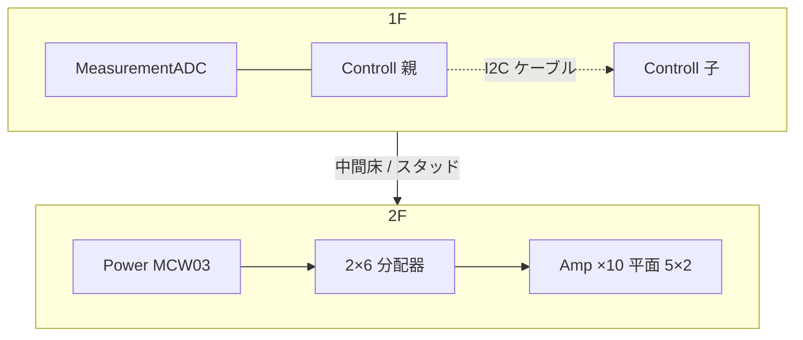

# バリアント B: Planar Amp Floor

最終更新: **2026-08-22**  
制約準拠: [`../../CASE_LAYOUT_CONSTRAINTS.md`](../../CASE_LAYOUT_CONSTRAINTS.md)

## 目標

- **2F で Amp×10 をできるだけ平面配置**（スタックは最終手段）
- サービス性・配線の見通しを優先
- **1F** = Controll 親・子（**ケーブル接続**）＋ MeasurementADC
- **Power** = 2F 後端（余深を利用）。1F 側端も可だが幅が増える
- **PD** = 配置最適化対象外
- **RV panel / RV convert** = 本案では箱計画に含めない（任意・後付け可）

主案は **Amp 10 枚すべて平面（5×2）**。幅を絞る必要がある場合のみ **8 平面＋2 軽スタック** に折衷する。

---

## 1. フロア平面図

座標系: 内寸原点 = 箱内左前下。+X = 右、+Y = 奥（前面→背面）。単位 mm。

### 1F（サービスフロア）

```text
Y↑ 背面
│
│  ┌──────── Controll 子 98.2×163 ──────┐ ┌─ Controll 親 98.2×163 ─┐
│  │  (I2C スレーブ・ケーブル)            │ │  OLED 基板側 / J13→前面 │
│  └────────────────────────────────────┘ └───────────────────────┘
│                         ↑ I2C 4線ケーブル（短・寄り添い）
│  ┌──────────── MeasurementADC 182.6 × 83.7 ────────────┐
│  │  LCD(WAVESHARE-29318) → 前面開口                      │
│  └──────────────────────────────────────────────────────┘
└──────────────────────────────────────────────────────────► X
   前面（パネル）
```

- Controll 親・子は **長辺を奥行き方向**に置き、短辺 98.2 mm を幅方向に並べる（2枚で幅 ≈ 200.4 mm＋隙間 4 mm）。
- MeasurementADC を前面に置き、LCD 開口に直結。
- Controll 親↔子は **ピン直結禁止**。J17 相当 `GND / 3V3 / SCL / SDA` を 4 線ケーブル。
- 前面エンコーダはパネル穴＋ケーブル（J13）。親基板は前面直置き不要。

### 2F（Amp 平面フロア）

```text
Y↑ 背面
│  ┌─ Power 55.3×44.0 ─┐   ← 2F 後端（本推奨）
│  └───────────────────┘
│     分配器ゾーン（±15 / A_GND）＋ケーブルダクト ≈20 mm
│  ┌────┐┌────┐┌────┐┌────┐┌────┐
│  │A6  ││A7  ││A8  ││A9  ││A10 │   奥列（短辺 41.5 が幅方向）
│  └────┘└────┘└────┘└────┘└────┘
│  ┌────┐┌────┐┌────┐┌────┐┌────┐
│  │A1  ││A2  ││A3  ││A4  ││A5  │   前列
│  └────┘└────┘└────┘└────┘└────┘
└────────────────────────────────► X
   （1F Controll / ADC の直上）
```

Amp 1 枚外形: **58.18 × 41.50**。向き: **短辺(41.50)∥幅、長辺(58.18)∥奥行き**。

| 配置 | アレイ占有 (隙間 4 mm) | 床＋余白・ダクト概算 |
| --- | --- | --- |
| **5×2 全平面（推奨）** | 223.5 × 120.4 | ≈ **240 × 156** |
| 4×2 平面＋上段 2（折衷） | 178.0 × 120.4 | ≈ 194 × 156 |
| 2×5 全平面 | 120.4 × 223.5 | 幅は狭いが奥行きが 1F と噛み合いにくい |



上面寸法図: [`top_view.svg`](top_view.svg) / [`top_view.txt`](top_view.txt)

---

## 2. 概算内寸（逆算）

### 推奨内寸（10 枚全平面）

| 軸 | 内寸 mm | 根拠 |
| --- | ---: | --- |
| **W（幅）** | **250** | Amp 5×2 アレイ 223.5 ＋左右余白 ≈12〜13。1F Controll 対 200.4 / ADC 182.6 に余裕 |
| **D（奥行）** | **280** | 1F: ADC 83.7 ＋隙間 4 ＋ Controll 163 ≈ 251 ＋前後余白。2F: Amp 120 ＋ダクト 20 ＋ Power 44 ＋余白 |
| **H（高さ）** | **95** | 1F 部品高 ≈25 ＋中間クリア ≈20 ＋ 2F Amp ≈20 ＋蓋側サービス ≈25（ヒンジ／Pico2） |

外寸目安（壁厚 3 mm 想定）: 約 **256 × 286 × 101**。

Power を **1F 側端**に置く場合は **W ≈ 280**（Power 55 ＋隙間）。本推奨は **Power を 2F 後端**にして幅を抑える。

### 平面で何枚まで現実的か

| 内寸 W 目安 | 平面枚数 | 残り |
| ---: | ---: | --- |
| **≥ 240**（本推奨 250） | **10（5×2）** | なし |
| 200〜220 | **8（4×2）** | 2 枚を前列 2 箇所の上に軽スタック（スペーサ 12〜15 mm） |
| ≤ 180 | **6（3×2）** | 4 枚を 2 スタック×2 — 本バリアントの主眼から外れる |

**結論:** DIY インストゥルメント箱として **W250×D280 は現実的**。よって本案の主推奨は **10 枚すべて平面**。幅制約が厳しい製品シェルのみ 8＋2 折衷。

---

## 3. M3 スタッド計画

すべて既存 MountingHole（drill 3.2 / M3）を使用。基板に新規穴は増やさない。

### ベースプレート（1F）

| 基板 | 穴ローカル座標（制約書どおり） | シャーシ上の扱い |
| --- | --- | --- |
| MeasurementADC | (3.50,3.50)(77.64,3.51)(179.08,3.51)(3.47,80.20)(89.39,80.22)(179.09,80.18) | M3 スタッドまたは hex スペーサ×6。前面寄せ配置 |
| Controll 親 | (3.50,3.50)(159.50,3.50)(3.50,94.70)(159.50,94.70) | 90° 回転後に座標変換して打つ×4 |
| Controll 子 | 同上 | 親の右（または左）隣。親と **同高さ・独立スタッド**（積み重ねない） |

### 中間床（2F Amp デッキ）

- 材: アルミ 1.5〜2 mm またはアクリル 3 mm。1F ベースから **M3 支柱**で浮かせる（クリア ≈ 35〜45 mm 推奨: 1F 部品＋配線）。
- Amp 各枚の 4 穴:
  - (3.48, 3.47), (54.73, 3.42), (3.48, 38.02), (54.63, 37.97)
- **5×2 格子**で 10×4 = **40 本**の M3 スタッド／スペーサ。ピッチは外形＋隙間 4 mm に合わせた繰り返し。
- 端子台が手前（またはダクト側）に揃うよう、全 Amp の向きを統一。

### Power（2F 後端）

- 穴: (3.52,3.51)(51.77,3.51)(3.52,40.51)(51.77,40.51) → 中間床または後端ブラケットに M3×4。

### 締結メモ

- ナット側は底板／中間床の裏面。サービス時はヒンジ蓋から上方向にアクセス。
- Controll 親・子間に **スタックピン用スペーサを使わない**（ケーブルのみ）。

---

## 4. パネル穴リスト

前面を主操作面。座標は内寸 W250 想定の **仮置き**（中心）。未確定は TBD。

| 開口 | 面 | 概寸 / 穴 | 仮中心 (X, Z from bottom of panel) | 状態 |
| --- | --- | --- | --- | --- |
| LCD（WAVESHARE-29318） | 前面 | 視認開口 ≈ **50 × 75**（表示 48.96×73.44）。モジュール外形 61.00×92.44 | (125, 55) 付近・ADC 直上 | **必須** |
| 入力ジャック L/R | 前面 | φ6.5 想定（型番 TBD） | (40, 25) / (60, 25) | 必須・TBD |
| 出力ジャック L/R | 前面 | φ6.5 想定 | (190, 25) / (210, 25) | 必須・TBD |
| ボリューム L/R | 前面 | φ7〜8（ポット軸 TBD） | (40, 55) / (60, 55) | 必須・TBD |
| ロータリ（エンコーダ） | 前面 | φ7＋インデント | (90, 55) | 必須・J13 ケーブル |
| 全体 ON/OFF | 前面 or 側面 | 型番 TBD | 側面左 (Z=40) | 必須・TBD |
| φ5 LED＋メタルカバー | 前面 | **穴 ≈ 6.5 mm** | (230, 55) | 必須 |
| USB（計測 Pico） | フタ内側／背面寄り | ヒンジ蓋前提。外部常時露出不要可 | TBD | 可 |

HP ゲイン1倍バッファ用穴は将来枠のみ（今回カットしない）。

---

## 5. ケーブル表

| # | From → To | 用途 | AWG | 概算長 | 備考 |
| ---: | --- | --- | ---: | ---: | --- |
| 1 | Controll 親 J17 → Controll 子 | I2C `GND/3V3/SCL/SDA` | 30 | **80〜120 mm** | 400 kHz。寄り添いツイスト相当。延長しすぎない |
| 2 | 前面エンコーダ → Controll 親 J13 | ロータリ | 30 | 150〜200 | パネル→親 |
| 3 | PD(+15/PD_GND) → Power / Controll×2 / 計測デジ入口 | PD 一次 | 26 | TBD（外付け） | **配置対象外** |
| 4 | Power 二次 ±15 → 2×6 分配器 | アナログ電源 | 26 | 80〜120 | 2F 後端ショートラン |
| 5 | Power A_GND → 分配器 | アナログ GND | 26 | 80〜120 | スター／バス。ループ禁止 |
| 6 | 分配器 → Controll AMP_PWR_IN | ±15 / A_GND | 26 | 200〜280 | フロア間。ダクト通し |
| 7 | 分配器 → MeasurementADC ±15V_A / A_GND | 計測アナログ | 26 | 180〜250 | フロア間 |
| 8 | Controll リレー出力 → Amp×10（選択中のみ） | Amp 電源 | 26 | 120〜200 | 常時全通電しない |
| 9 | 分配器 A_GND → Amp×10 | A_GND | 26 | 100〜180 | 並列ドロップ |
| 10 | 入力ジャック → ボリューム手前端子 → Controll | 信号 L/R | 30 | 120〜180 | 手前でハイZ分岐 |
| 11 | 同端子 → MeasurementADC | スペアナ・ハイZ | 30 | 100〜150 | |
| 12 | Controll → Amp 入力（選択経路） | 信号 | 30 | 150〜220 | |
| 13 | Amp 出力 → 出力ジャック×2 | 信号 | 30 | 150〜220 | |
| 14 | 12V → φ5 LED | 電源表示 | 26 | 100〜150 | |

分配は **2×6 分配器**前提。フロア間は中間床のケーブルダクト（Amp 列と Power の間 ≈20 mm）を最短寄りで通す。

---

## 6. リスク

1. **1F 奥行き支配:** Controll を回転配置しても D≈250 mm 級が必要。浅い市販箱だと Controll 子を 1F に並べられず、案の前提が崩れる。
2. **Amp×10 の M3 点数（40）:** 中間床の穴加工・位置公差が厳しい。4 mm 隙間だと配線・ドライバアクセスが窮屈 → 隙間を 5〜6 mm に広げると W が 250 を超える。
3. **フロア間アナログ電源／信号の束:** ダクトに ±15・A_GND・リレー・信号が集中。分離不足だとノイズ／ループ。A_GND スターを崩さない配線図が別途必要。
4. （副次）**放熱:** 平面はスタックより有利だが、密閉 W250 箱＋選択通電でも局所発熱。通気スリットは後追い検討。
5. （副次）**LCD 開口位置:** ADC 基板上のモジュール実装座標と前面穴の芯ずれ。実物合わせて微調整必須。

### 棄却・非採用

- Amp 全面 1F 同居（Controll/ADC と同面）: 制約「全面一面並べはしない」に抵触し幅が非現実的。
- Controll 親↔子のピンヘッダスタック: 制約違反。
- 10 枚を 2×5 奥行き優先: 1F の幅余力を活かせず、後列 Amp のサービス性が落ちるため本バリアントでは非推奨。

---

## 7. 成果物一覧

| ファイル | 内容 |
| --- | --- |
| `README.md` | 本資料 |
| `top_view.svg` | 上面寸法（1F/2F オーバーレイ） |
| `top_view.txt` | 同上テキスト寸法 |

---

## 8. 次の作業（本 PR 範囲外）

- ジャック／ポット型番確定後のパネル穴座標の実寸化
- 中間床 DXF（M3 穴パターン）
- FreeCAD 筐体は後回し（制約どおり 2D 優先）
