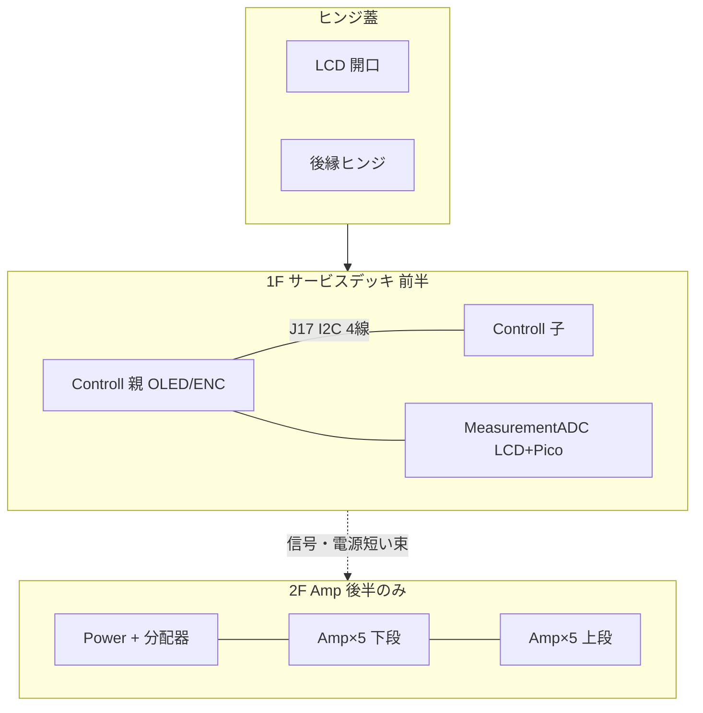

# バリアント C: Serviceability / Hinged Lid

**方針:** ヒンジ蓋メンテ性最優先。計測 Pico2・USB・LCD、Controll OLED／エンコーダへ蓋を開けて最短で届く。ケーブルは短く束ね、Amp は 1F/2F の折衷（後段のみ 2×5 スタック）。

制約根拠: [`../../CASE_LAYOUT_CONSTRAINTS.md`](../../CASE_LAYOUT_CONSTRAINTS.md)  
図面: [`floor_plan.svg`](floor_plan.svg) / [`lid_open_access.svg`](lid_open_access.svg)

---

## 1. 提案要約

| 項目 | 内容 |
| --- | --- |
| 蓋 | 後縁ヒンジ。前縁ラッチ。LCD 開口は蓋（または前パネル上縁と連続する蓋開口） |
| 1F（サービスデッキ） | Controll 親＋子＋ MeasurementADC。Amp の下に潜らない |
| Controll | XY は親の下に子を **M3 スペーサで機械 2 段**。電気は **J17 相当 I2C 4 線ケーブルのみ**（ピン直結禁止） |
| 親の向き | OLED・J13 エンコーダを **手前／蓋側**。蓋開で触れる |
| MeasurementADC | Controll の右隣。LCD 上面。Pico USB は **蓋ヒンジ側のサービス通路**へ向ける |
| 2F Amp | 箱の **後半のみ** に 2×5。前半 1F は常に蓋から丸見え |
| Power / 分配器 | 後隅。PD 入口近傍。A_GND スターをここに集約 |
| RV panel / convert | **本案では箱計画に含めない**（任意・後付け可） |

---

## 2. フロア図（1F / 2F）

座標は箱内寸の左前隅を (0,0)、+X=右、+Y=奥（ヒンジ方向）。単位 mm。

```text
前パネル (Y=0)
┌──────── VOL L/R · IN · OUT · SW · LED≈6.5 · ENC ────────┐
│  X≈10..173          gap≈15          X≈188..371          │
│ ┌ Controll 親(上) ┐                ┌ MeasurementADC ┐   │  1F
│ │ 163×98          │   I2C J17      │ 183×84         │   │
│ │ OLED/ENC 手前   │◄── 80〜120mm ─►│ LCD↑ / Pico→奥 │   │
│ │ Controll 子(下) │   寄り添い4線   │ USB サービス側  │   │
│ └ M3 2段 ────────┘                └────────────────┘   │
│         サービス通路（蓋開で手・USBが入る） Y≈100..130     │
├──────────────────── 2F Amp デッキ開始 Y≈140 ─────────────┤
│  Amp 上段 A6–A10 （M3 スペーサ ≈20mm）                    │  2F
│  Amp 下段 A1–A5  各 58×42、列間ギャップ ≈8               │
│  [A1][A2][A3][A4][A5]   幅 ≈ 5×58 + 4×8 ≈ 322           │
│  後隅: Power 55×44 + 2×6 分配器 + PD 入口                 │
└──────────────────────── ヒンジ Y≈H_in ───────────────────┘
```

Mermaid（論理配置）:



詳細 SVG: [`floor_plan.svg`](floor_plan.svg)

---

## 3. 蓋を開けたときのアクセス

```text
蓋を前方向へ開く（ヒンジ＝奥）
        ＼
         ＼ 蓋
          ＼
═══════════════════════════════  ← ヒンジ線
  [Pico USB] [LCD 裏コネクタ]     ← すぐ触れる
  [Controll OLED] [ENC 配線] [J17]
────────────────────────────────
  （奥・一段高い）Amp 2×5 / Power   ← 常用メンテ対象外
```

| 対象 | 蓋開時の到達 | 備考 |
| --- | --- | --- |
| 計測 Pico2 / USB | **直達** | USB は蓋内サービス通路。フタ側開口も可（TBD） |
| LCD / タッチ配線 | **直達** | モジュール 61×92.44。蓋開口は表示面＋余裕 |
| Controll OLED | **直達** | 親を上段に置く |
| Controll エンコーダ J13 | **直達**＋前パネル軸 | 軸は前パネル、コネクタ側は蓋内 |
| Controll J17 I2C | **直達** | 親↔子 80〜120 mm、寄り添いツイスト |
| Amp / Power | 蓋開＋必要なら 2F デッキ側から | 頻度低。リレー給電のみ |

SVG: [`lid_open_access.svg`](lid_open_access.svg)

### 蓋側に置くもの（リスト）

1. **LCD 開口**（WAVESHARE-29318 表示面。モジュール外形 61.00×92.44 mm、有効表示 48.96×73.44 mm）
2. **計測 Pico USB アクセス**（蓋内開口 or 蓋開のみ。外部常時挿しは任意）
3. **ヒンジ＋前縁ラッチ**
4. （任意）薄い EMI／光漏れガスケット。基板本体は 1F 側

※ Controll OLED は基板上部品のため **蓋には載せず**、蓋開口または透明窓で視認してもよい（本案は蓋開メンテ前提で OLED 用の常時窓は必須としない）。

---

## 4. スタッキングと推奨内寸

### Amp

- **後半のみ 2×5 スタック**（平面全並べしない＝制約準拠）
- 下段 5 枚を 2F プレートに既存 M3 で固定、上段 5 枚を樹脂スペーサ ≈20 mm
- 前列 1F（Controll＋Meas）の上には Amp を載せない → サービス性と線長の両立

### Controll

- 子＝下、親＝上、スペーサ ≈15〜20 mm（部品クリア）
- 電気接続は **J17: GND / 3V3 / SCL / SDA** のみ（400 kHz、短く寄り添い）

### 推奨内寸（逆算）

| 軸 | 内寸 mm | 根拠 |
| --- | ---: | --- |
| **W** | **380** | Controll163 + gap15 + Meas183 + 側壁余裕 ≈19 |
| **D** | **310** | 前パネル控え35 + 1F≈100 + 通路25 + Amp列≈90 + Power/ヒンジ帯≈60 |
| **H** | **100** | 1F スタッド10 + Controll 2段≈40〜45 + 蓋下クリア（LCD/配線）≈35〜40。Amp 2段は後半のみで高さ内に収める |

外形は板厚＋脚で +10〜20 mm 程度を別途見る。市販箱は **内寸 W≥380 / D≥310 / H≥100** を下限候補とする。

余裕を見るなら **W400 × D330 × H110**（配線・ヒンジ干渉用）。

---

## 5. M3 取付計画（既存穴のみ）

すべて基板既存 **drill 3.2 / M3**。新規基板穴は作らない。

| 基板 | 穴（ローカル mm） | シャーシ側 |
| --- | --- | --- |
| Controll 親・子 各4 | (3.5,3.5)(159.5,3.5)(3.5,94.7)(159.5,94.7) | 1F スタッド＋段間スペーサ。親子で XY を揃えてボルト貫通可 |
| MeasurementADC 6 | (3.5,3.5)(77.64,3.51)(179.08,3.51)(3.47,80.20)(89.39,80.22)(179.09,80.18) | 1F スタッド 6 本 |
| Amp×10 各4 | (3.48,3.47)(54.73,3.42)(3.48,38.02)(54.63,37.97) | 2F プレート。上段はスペーサ経由で下段穴と同心 |
| Power 4 | (3.52,3.51)(51.77,3.51)(3.52,40.51)(51.77,40.51) | 後隅シャーシ or 2F 端 |

2F プレートはシャーシ側壁または縦柱に M3 で固定。Amp の荷重はプレートが受ける。

---

## 6. パネル穴リスト

| 面 | 開口 | 寸法／備考 | 状態 |
| --- | --- | --- | --- |
| **蓋** | LCD | 表示面ベース **約 50×75** 〜 モジュール逃げ **約 62×94**（実装後に実測合わせ） | 必須 |
| **蓋** | Pico USB（任意） | Pico micro/USB-C 実機に合わせる。無くても蓋開で足りる | TBD |
| **前面** | 入力ジャック L/R | 型番 TBD。ボリューム手前 | 必須 |
| **前面** | 出力ジャック ×2 | 型番 TBD | 必須 |
| **前面** | ボリューム ×2 | ポット軸。中心間隔 TBD（仮 40 mm） | 必須 |
| **前面** | ロータリ（ENC） | Controll 親 J13。軸延長 or パネル直結 TBD | 必須 |
| **前面** | 全体 ON/OFF | 型番 TBD | 必須 |
| **前面** | 電源 LED | **φ5 mm LED ＋メタルカバー → 穴 ≈6.5 mm、12 V** | 必須 |
| **後面／側面** | PD ケーブル／電源入口 | 配置最適化対象外。後隅寄せ | 仮 |

---

## 7. ハーネス表

線長は 1F↔2F 最短寄り。過剰延長しない。

| ID | From → To | 用途 | AWG | 概算長 | 束ね |
| --- | --- | ---: | ---: | --- |
| H1 | Controll 親 J17 ↔ 子 J17 | I2C `GND/3V3/SCL/SDA` | 30（寄り添い） | **80〜120 mm** | 単独・最短。ピンスタック禁止 |
| H2 | 前パネル IN → VOL → Controll 入力 | アナログ L/R | 30 | 150〜250 | 信号束。A_GND 同伴 |
| H3 | 前パネル手前タップ → Meas アナログ IN | ハイZ スペアナ | 30 | 120〜200 | H2 から分岐短く |
| H4 | Controll → Amp 選択信号／リレー出力 | 選択中 Amp のみ ±15 | 26 | 200〜280 | 電源束。全 Amp 常時通電しない |
| H5 | Controll → 出力 J ×2 | ライン OUT | 30 | 150〜220 | 信号束 |
| H6 | Power ±15 / A_GND → 2×6 分配器 | 二次電源 | 26 | ≤100 | 後隅完結 |
| H7 | 分配器 → Controll AMP_PWR_IN / Meas ±15V_A | ±15・A_GND | 26 | 150〜250 | スター／バス。ループ禁止 |
| H8 | 分配器 → Amp×10（リレー二次側と整合） | A_GND 並列、±15 はリレー経由 | 26 | 100〜180 | Amp 列に沿う |
| H9 | PD(+15/PD_GND) → Power / Controll×2 / 計測デジ入口 | 一次 | 26 | 短く | PD 最適化対象外 |
| H10 | 前パネル LED（12 V φ5）→ 電源表示点 | LED | 26 | 120〜180 | SW 近傍 |
| H11 | Controll 親 ↔ 前パネル ENC | J13 | 30 | 100〜160 | パネル軸と干渉しない余長のみ |
| H12 | （将来）手前タップ → HP 1×バッファ | ハイZ | 30 | TBD | 未製。スペースのみ確保可 |

分配器は **2×6** 前提。A_GND はここでスターし、箱内でループを作らない。

---

## 8. メンテ手順（短文）

1. 電源 OFF → 前縁ラッチ解除 → 蓋を奥ヒンジで開く。  
2. **計測:** Pico USB 挿抜、LCD／ジャンパ、±15 端子を 1F 上で作業。  
3. **Controll:** 上段親の OLED・J13・J17 を確認。子はスペーサ下だが I2C ケーブル側から探針可。必要なら上段ボルトのみ外し親を起こす（Amp は触らない）。  
4. **Amp / Power:** 頻度低。2F 後半へ手を伸ばすか、該当列スペーサを外す。  
5. 閉じる前に H1（I2C）の寄り添いと A_GND スターを目視 → 蓋閉。

---

## 9. リスク

1. **ヒンジ／蓋開口と LCD 位置の公差** — モジュール 61×92 に対し蓋穴がずれると縁欠け・タッチ不良。実機仮組み後に開口を仕上げる。  
2. **Controll 2 段＋後半 Amp 2 段で内高 100 mm がタイト** — 部品高・配線だぶつきで干渉しうる。初号は H110 を推奨、または Amp 上段スペーサを 15 mm まで詰める。  
3. **J17 I2C（400 kHz）とパネル ENC 線の並行** — 長すぎ／電源束との平行は OLED 転送エラーの元。H1 は 120 mm 超にせず、電源束と交差は直角寄り。  
4. （副）Amp を後半に寄せるため Controll→Amp の H4/H5 が平面案よりやや長い — 許容内に収めるため 2F 開始を Y≈140 に固定し、これ以上奥に退けない。  
5. （副）蓋開時に 2F Amp の角が手に当たる — 2F 前縁に面取りまたはガード縁を付ける。

---

## 10. 本案でやらないこと

- EQ 基板、PD 精密配置、FreeCAD 本格筐体  
- RV panel / RV convert の固定配置（含めない）  
- Controll 親↔子のピンヘッダ直結  
- Amp 10 枚の全面 1 平面並べ  

---

## ファイル

| ファイル | 内容 |
| --- | --- |
| `README.md` | 本ドキュメント |
| `floor_plan.svg` | 1F/2F 平面（テキスト寸法付き） |
| `lid_open_access.svg` | 蓋開アクセス概念図 |
